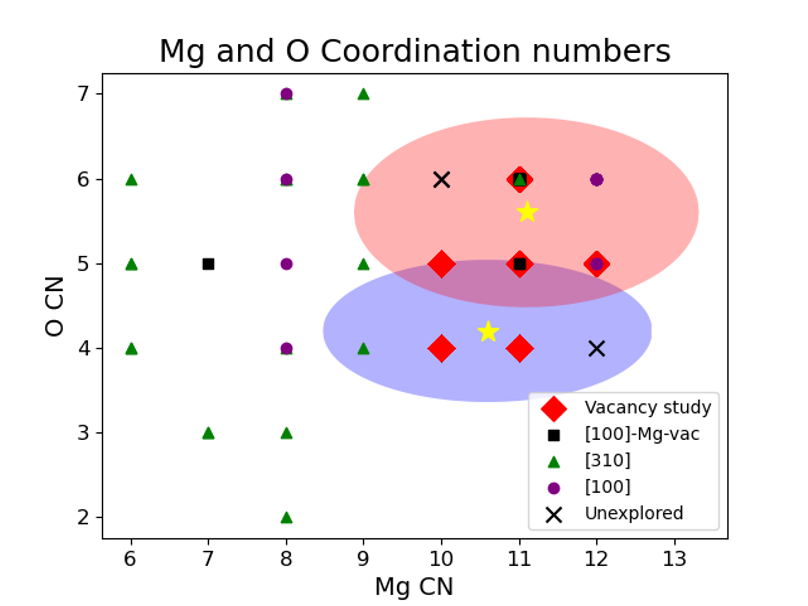

Overview
========

Calculations of sub1 Pt/MgO models will be considered here. W

Extensive experimental characterization of the Pt/MgO700-R confirms the structure remains atomically dispersed, but XAS data shows a reduction in the oxidation state of Pt (using XANES) and a decrease in the Pt-O and Pt-Mg coordination number (using EXAFS). Data suggest that Pt remains subsurface and indicates that the reductive treatment may result in additional defect sites. We conducted a large-scale DFT-based combinatorial study of all possible subsurface Pt structures with any combination of 1-4 vacancies in the first coordination shell of Pt (considered both Mg and O vacancies).

